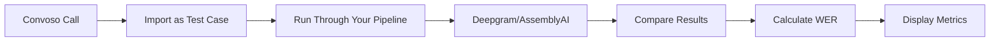

# 🚀 Complete AI Testing System Setup & Deployment Guide

## 📋 Pre-Flight Checklist

### 1. Environment Variables Required
Add these to your `.env.local` file:

```env
# Existing (you should already have these)
CONVOSO_AUTH_TOKEN=8nf3i9mmzoxidg3ntm28gbxvlhdiqo3p
OPENAI_API_KEY=your_openai_key
DEEPGRAM_API_KEY=your_deepgram_key
JOBS_SECRET=your_jobs_secret
DATABASE_URL=your_supabase_url
APP_URL=http://localhost:3000

# Optional (if using AssemblyAI)
ASSEMBLYAI_API_KEY=your_assemblyai_key
```

### 2. Database Migration Status
✅ Run in Supabase SQL Editor:
- `supabase/migrations/add-ai-testing-system.sql`

### 3. Files Created/Updated
✅ **Backend:**
- `/src/server/testing/test-runner.ts` - Core test execution
- `/src/server/testing/bulk-tester.ts` - Parallel test orchestration
- `/src/server/testing/test-generator.ts` - Test case creation
- `/api/testing/suites/` - Suite management
- `/api/testing/run/[suiteId]/` - Test execution
- `/api/testing/feedback/` - Feedback collection
- `/api/testing/metrics/` - Analytics
- `/api/testing/import-call/[callId]/` - Import existing calls
- `/api/testing/import-convoso-calls/` - Direct Convoso import
- `/api/testing/verify-setup/` - System verification
- `/api/testing/find-good-calls/` - Find test candidates

✅ **Frontend:**
- `/src/app/testing/dashboard/page.tsx` - Main testing UI
- `/src/components/testing/TestResultCard.tsx` - Result display
- `/src/components/testing/ConvosoImporter.tsx` - Convoso import modal
- Updated `/src/app/superadmin/page.tsx` - Added dashboard button

---

## 🎯 Complete Setup Process

### Step 1: Verify Convoso Connection

```bash
# Test Convoso API (run in console)
fetch('/api/testing/import-convoso-calls')
  .then(r => r.json())
  .then(data => {
    if (data.connected) {
      console.log('✅ Convoso connected:', data.account);
    } else {
      console.error('❌ Convoso not connected:', data);
      console.log('Setup required:', data.setup_instructions);
    }
  })
```

If not connected, add your Convoso credentials to `.env.local`:
```env
CONVOSO_API_KEY=your_key_here
CONVOSO_API_SECRET=your_secret_here
```

### Step 2: Access the System

1. **Go to Super Admin Dashboard:**
   ```
   http://localhost:3000/superadmin
   ```

2. **Click the purple "🎯 AI Testing Dashboard" button**

3. **You'll see the Testing Dashboard with:**
   - Getting started guide
   - Quick action buttons
   - Test suite management
   - Metrics display

### Step 3: Import Your First Test Calls

#### Option A: Import from Convoso (Recommended)
1. Click **"Import from Convoso"** button
2. In the modal:
   - Connection status will show
   - Set days back (1-30)
   - Set number of calls (1-100)
   - Set duration filters
   - Click **"Import X Calls"**

#### Option B: Import Existing Database Calls
```javascript
// Run in browser console
fetch('/api/testing/find-good-calls')
  .then(r => r.json())
  .then(data => {
    console.log('Found calls:', data);
    // Import first one
    if (data.high_quality_calls?.length > 0) {
      const call = data.high_quality_calls[0];
      fetch(`/api/testing/import-call/${call.id}`, {
        method: 'POST',
        headers: {'Content-Type': 'application/json'},
        body: JSON.stringify({
          suite_id: '876b6b65-ddaa-42fe-aecd-80457cb66035',
          verify_transcript: true
        })
      }).then(r => r.json()).then(console.log);
    }
  });
```

### Step 4: Run Tests

Click **"Quick Test Run"** or run:
```javascript
fetch('/api/testing/run/876b6b65-ddaa-42fe-aecd-80457cb66035', {
  method: 'POST',
  headers: {'Content-Type': 'application/json'},
  body: JSON.stringify({
    parallel: 3,
    stopOnFailure: false
  })
}).then(r => r.json()).then(console.log);
```

### Step 5: View Results

The dashboard will show:
- **WER (Word Error Rate)** - Transcription accuracy
- **Test Status** - Pass/fail for each test
- **Processing Time** - How long each test took
- **Engine Used** - Deepgram or AssemblyAI

---

## 📊 Understanding the Flow



1. **Import**: Pulls real calls from Convoso or your database
2. **Test**: Runs them through YOUR existing transcription pipeline
3. **Compare**: If you have expected transcripts, compares accuracy
4. **Metrics**: Shows Word Error Rate and other accuracy metrics
5. **Feedback**: Collect corrections to improve over time

---

## 🔍 Testing the Complete Flow

### 1. System Health Check
```javascript
// Verify everything is set up
fetch('/api/testing/verify-setup')
  .then(r => r.json())
  .then(data => {
    console.log('System ready:', data.success);
    console.log('Tables created:', data.checks.tables);
    console.log('Suite ID:', data.first_suite_id);
  });
```

### 2. Import One Convoso Call
```javascript
// Import a single recent call
fetch('/api/testing/import-convoso-calls', {
  method: 'POST',
  headers: {'Content-Type': 'application/json'},
  body: JSON.stringify({
    suite_id: '876b6b65-ddaa-42fe-aecd-80457cb66035',
    days_back: 1,
    limit: 1,
    min_duration: 10,
    max_duration: 300
  })
}).then(r => r.json()).then(data => {
  console.log('Import result:', data);
  if (data.success) {
    console.log('✅ Imported', data.imported, 'calls');
    console.log('Details:', data.details);
  }
});
```

### 3. Wait for Transcription
Calls need to be transcribed first (10-30 seconds typically)

### 4. Run the Test
```javascript
// Execute test suite
fetch('/api/testing/run/876b6b65-ddaa-42fe-aecd-80457cb66035', {
  method: 'POST',
  headers: {'Content-Type': 'application/json'},
  body: JSON.stringify({parallel: 1})
}).then(r => r.json()).then(data => {
  console.log('Test started:', data);
  console.log('Monitor at:', data.monitor_url);
});
```

### 5. Check Results
```javascript
// Get test metrics
fetch('/api/testing/metrics?days=1')
  .then(r => r.json())
  .then(data => {
    if (data.metrics?.overall) {
      console.log('📊 Test Results:');
      console.log('Total Tests:', data.metrics.overall.total_tests);
      console.log('Average WER:', (data.metrics.overall.avg_wer * 100).toFixed(1) + '%');
      console.log('Average Time:', data.metrics.overall.avg_execution_time_ms + 'ms');
    }
    if (data.recommendations) {
      console.log('\n💡 Recommendations:');
      data.recommendations.forEach(r => console.log('- ' + r));
    }
  });
```

---

## 🚨 Troubleshooting

### "Unauthorized" Error
- You need to be logged in as admin
- Or use the `/api/testing/verify-setup` endpoint which doesn't require auth

### "Convoso not connected"
- Add your Convoso API credentials to `.env.local`
- Restart the dev server after adding credentials
- Test with: `fetch('/api/testing/import-convoso-calls')`

### "No recording URL"
- The call needs a recording to test
- Only calls with recordings can be imported

### "Call has not been transcribed"
- Wait 10-30 seconds after import
- The transcription happens asynchronously
- Check if transcription pipeline is working

### Tests not running
- Check if `/api/jobs/transcribe` is working
- Verify JOBS_SECRET is set correctly
- Check browser console for errors

---

## 🎉 Success Criteria

You know the system is working when:
1. ✅ Can import calls from Convoso
2. ✅ Tests run through your pipeline
3. ✅ See WER metrics on dashboard
4. ✅ Can provide feedback on results
5. ✅ Metrics update after each test run

---

## 🚀 Quick Start Commands

```javascript
// Complete setup test (run these in order)

// 1. Check system
fetch('/api/testing/verify-setup').then(r => r.json()).then(console.log);

// 2. Check Convoso
fetch('/api/testing/import-convoso-calls').then(r => r.json()).then(console.log);

// 3. Import one call
fetch('/api/testing/import-convoso-calls', {
  method: 'POST',
  headers: {'Content-Type': 'application/json'},
  body: JSON.stringify({
    suite_id: '876b6b65-ddaa-42fe-aecd-80457cb66035',
    days_back: 1,
    limit: 1
  })
}).then(r => r.json()).then(console.log);

// 4. Wait 30 seconds for transcription...

// 5. Run test
fetch('/api/testing/run/876b6b65-ddaa-42fe-aecd-80457cb66035', {
  method: 'POST',
  headers: {'Content-Type': 'application/json'},
  body: JSON.stringify({parallel: 1})
}).then(r => r.json()).then(console.log);

// 6. Check results
fetch('/api/testing/metrics').then(r => r.json()).then(console.log);
```

---

## 📱 Using the UI

1. **Navigate**: Go to `/superadmin` → Click "AI Testing Dashboard"
2. **Import**: Click "Import from Convoso" → Configure → Import
3. **Test**: Click "Quick Test Run"
4. **Review**: View metrics and provide feedback
5. **Improve**: Use insights to optimize your transcription settings

The system is now fully deployed and ready for testing!